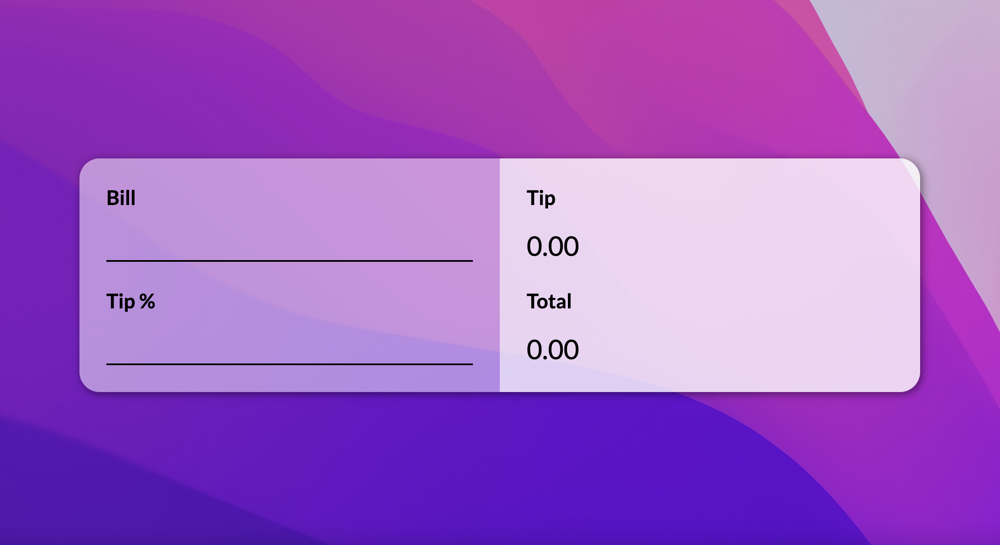
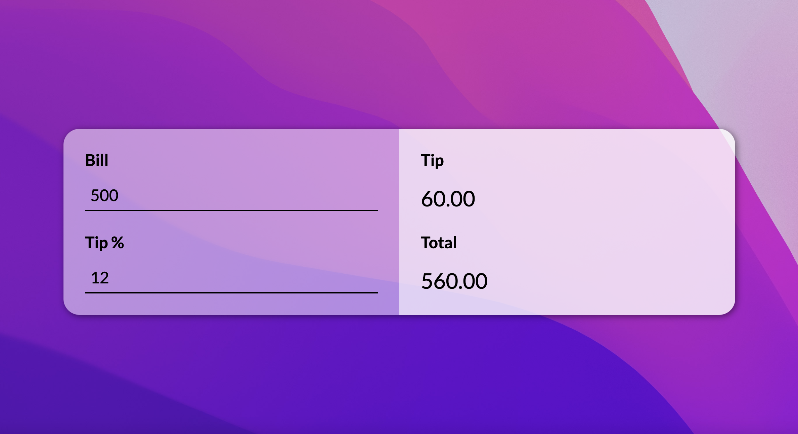

# Project Title

Tip Calculator

## Description

Calculates tip according to input bill and desired tipping percentage

## Preview



## Getting Started

### Dependencies

* HTML
* CSS
* JavaScript
* Icons8

### Installing

* Clone repo using HTTPS or download manually
* Open in VSCode

### Executing program

Run on `Live Server` or `Five Server`

## Help

Any advise for common problems or issues.
```
command to run if program contains helper info
```

## Authors

Contributors names and contact info

ex. Hatem   
ex. [@codenkoffee](https://www.instagram.com/codenkoffee/)

## Version History

* 0.2
    * Various bug fixes and optimizations
    * See [commit change]() or See [release history]()
* 0.1
    * Initial Release

## License

This is an open source project